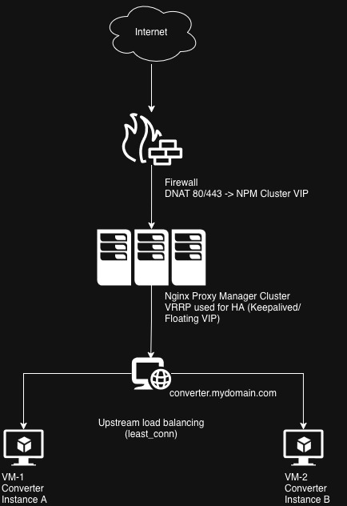

# On-Premises Deployment – plat-converter

## Architecture Overview

```
Internet
    |
    |  DNS A record: *.mydomain.com -> <PUBLIC_IP>
    v
[ Firewall ]
    |
    |  Port forward: TCP 80/443 -> NPM VIP
    v
[ NPM Node 1 ]  <-- MASTER (Keepalived VRRP)
[ NPM Node 2 ]  <-- BACKUP (Keepalived VRRP)
    |
    |  Proxy host: converter.mydomain.com
    |  Upstream load balancing (least_conn)
    |
    +------------------+
    v                  v
[ VM-1:8080 ]     [ VM-2:8080 ]
  Converter A       Converter B
```



---

## 1. DNS A Record

Create an A record pointing `*.mydomain.com` to the firewall's public IP. All inbound traffic enters the network through this single termination point.

---

## 2. Firewall Port Forwarding

Configure NAT rules on the firewall to forward TCP 80 and 443 from the WAN interface to the NPM cluster's Virtual IP (VIP). Traffic is never sent to an individual NPM node directly — it always targets the VIP so that Keepalived controls which node handles it.

---

## 3. VRRP with Keepalived

Install and configure Keepalived on both NPM nodes. Node 1 runs as `MASTER` and owns the VIP; Node 2 runs as `BACKUP`. If Node 1 becomes unavailable, Node 2 claims the VIP within one advertisement interval and takes over traffic. Both nodes share the same `virtual_router_id` and authentication passphrase.

---

## 4. Nginx Proxy Manager

Create a proxy host for `converter.mydomain.com` on the active NPM node. In the Advanced config, define an `upstream` block pointing to VM-1 and VM-2 on port 8080 using `least_conn` load balancing. Set the forward hostname to the upstream group name so NPM routes traffic across both converter instances.

---

## 5. Certificate and Data Sync

Use `rsync` over SSH to periodically copy the NPM data directory and the Let's Encrypt directory (certificates, account keys) from Node 1 to Node 2. Schedule this as a cron job on Node 1 so the backup always has current certificates and configuration — ensuring it can serve HTTPS traffic immediately upon failover without re-issuing certificates.
